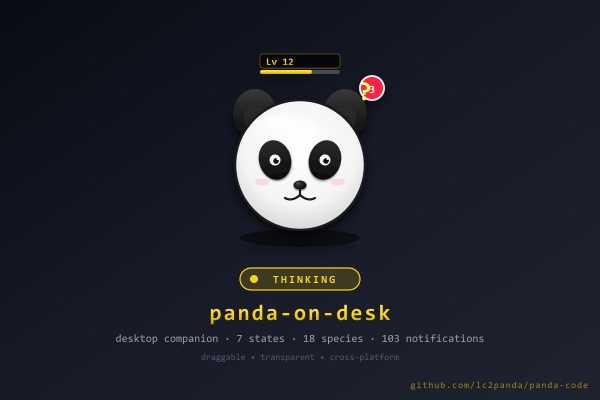

# panda-on-desk

> Input：panda CLI 状态信号（PetState / token / cmd-count） · 用户桌面交互
> Output：透明 overlay 浮窗 + 宠物养成可视化 + 通知聚合（Electron 41 GUI）
> Pos：panda monorepo 子包 — 与 panda CLI（根目录）解耦，独立打包分发；与 panda CLI 的关系是「感知端 ↔ 信号源」，不替代 CLI

[](https://github.com/lc2panda/panda/releases)
[](https://www.electronjs.org/)
[](./LICENSE)
[](#安装方式v10-ga)
[](./STATUS.md)

## Quick Links

| 文档 | 适用读者 | 内容 |
|------|---------|------|
| [README.md](./README.md) (本文) | 普通用户 | 安装 + 启动 + 18 物种 × 12 PetState + 故障排查 |
| [STATUS.md](./STATUS.md) | 全员（一键看板） | 当前版本 + 测试基线 + 性能基线 + 17+ 版本端到端 + 已知 bugs + 排查表 |
| [CONTRIBUTING.md](./CONTRIBUTING.md) | 贡献者 | 本地开发 + 资产替换 + 添加 PetState/物种/IPC + PR checklist |
| [ARCHITECTURE.md](./ARCHITECTURE.md) | 架构师 | 进程模型 + IPC 链路 + 状态机优先级 + 跨平台抽象 |
| [PRIVACY.md](./PRIVACY.md) | 隐私敏感用户 | 0 telemetry · 数据本地化 · 未来 opt-in 路线契约 |
| [LICENSE](./LICENSE) / [NOTICE](./NOTICE) | 法务 | MIT + clawd-on-desk 上游致谢 |
| [docs/INSTALL_TEST.md](./docs/INSTALL_TEST.md) | QA / 新用户 | 安装实测 walkthrough + 5+ 类常见报错排查 |
| [CHANGELOG](../../CHANGELOG.md) | 全员 | 版本变更与里程碑（v2.22.0 → v2.25.15） |

## Demo



> 截图占位：`build/screenshots/panda-demo-600x400.png`（W6-T1 落盘 · 真实美术 v1.5 替换）

## 架构总览（panda CLI ↔ HTTP IPC ↔ panda-on-desk）

```
   ┌─────────────────────────────┐                                      ┌──────────────────────────────┐
   │      panda CLI (Ink TUI)    │                                      │   panda-on-desk (Electron)   │
   │   @lc2panda/panda-code       │                                      │   @lc2panda/panda-on-desk    │
   │                              │                                      │                              │
   │  ┌────────────────────────┐ │                                      │  ┌────────────────────────┐ │
   │  │  PetState 12 态状态机   │ │   HTTP POST 127.0.0.1:1455+/state    │  │ main.ts (god file)     │ │
   │  │  103 主动场景调度       │ │ ───────────────────────────────────▶ │  │ 4 BrowserWindow        │ │
   │  │  /buddy theme/state    │ │                                      │  │ tray (6 项菜单)        │ │
   │  │  StatusLine mini-pet    │ │   SSE GET 127.0.0.1:1455+/events     │  │ dispatcher (103 场景)  │ │
   │  │  XP 11 桶 + 60 级       │ │ ◀─────────────────────────────────── │  │ state.ts (12 态)       │ │
   │  │  src/desk/bridge.ts    │ │                                      │  │ updater (auto-update)  │ │
   │  └────────────────────────┘ │   runtime.json (secret + port + pid) │  └────────────────────────┘ │
   │            ▲                │   ~/.pandacc/runtime.json            │            ▲                │
   │            │ spawn          │                                      │            │ contextBridge  │
   │  ┌────────────────────────┐ │   shared file:                       │  ┌────────────────────────┐ │
   │  │ desk-spawn.ts          │ │   ~/.config/panda/desk-state.json    │  │ preload sandbox        │ │
   │  │ (auto-launch on start) │ │   (XP / level / species 持久化)       │  │ panda:* IPC channels   │ │
   │  └────────────────────────┘ │                                      │  └────────────────────────┘ │
   │                              │                                      │            │                │
   └─────────────────────────────┘                                      │            ▼                │
                                                                        │  ┌────────────────────────┐ │
        信号源（authoritative）                                          │  │ renderer (4 windows)   │ │
        终端体验主体                                                     │  │ hit / bubble /         │ │
                                                                        │  │ settings / update      │ │
                                                                        │  └────────────────────────┘ │
                                                                        │                              │
                                                                        │   感知端（reactive）         │
                                                                        │   桌面 GUI 增强              │
                                                                        └──────────────────────────────┘

   关键约束：
   - byte-equal: panda-on-desk 0 触碰 src/services/api/{claude.ts,oauth/*,providers.ts}
   - 解耦: panda CLI 不依赖 panda-on-desk 即可独立运行 (`bun panda` 仍是 TUI 主体验)
   - HTTP local: 仅监听 127.0.0.1:1455+ (auto-fallback +1) — 无远程通信
   - secret + nonce: runtime.json 内 secret 双向校验，mismatch 401
```

## 7 状态切换流程图（PetState 主线）

```
                            ┌────────────────┐
                            │     idle       │  ◀──── 默认（无 active session）
                            │ (优先级 1)     │       呼吸动画
                            └───────┬────────┘
                                    │
              ┌─────────────────────┼─────────────────────┐
              │                     │                     │
              │ token 流式输出       │ 长任务 >5s           │ DEEP_SLEEP_TIMEOUT
              ▼                     ▼                     ▼
      ┌──────────────┐      ┌──────────────┐      ┌──────────────┐
      │   thinking   │      │   working    │      │   sleeping   │
      │ (优先级 2)   │      │ (优先级 3)   │      │ (优先级 0)   │
      │ 思考气泡      │      │ 工具图标 +   │      │ 闭眼 + Z字    │
      │              │      │ 进度脉冲      │      │              │
      └──────┬───────┘      └──────┬───────┘      └──────┬───────┘
             │                     │                     │ 鼠标移近
             │ 多任务 ≥ 2 session   │ 文件传输/下载        │ ▼
             ▼                     ▼              ┌──────────────┐
      ┌──────────────┐      ┌──────────────┐     │    waking    │
      │   juggling   │      │   carrying   │     │ 睁眼 + 伸展  │
      │ (优先级 4)   │      │ (优先级 4)   │     └──────┬───────┘
      │ 抛球动画      │      │ 抱箱 sprite  │            │
      └──────┬───────┘      └──────┬───────┘            ▼
             │                     │                ┌──────────────┐
             └─────────┬───────────┘                │     idle     │ ◀── 唤醒回 idle
                       │                            └──────────────┘
                       │ 等待用户确认 / 权限气泡
                       ▼
              ┌──────────────┐
              │  attention   │
              │ (优先级 5)   │
              │ 闪烁光圈      │
              └──────┬───────┘
                     │
                     │ 工具调用失败 / API 异常 / 解锁里程碑
                     ▼
              ┌──────────────┐         ┌────────────────────┐
              │    error     │ ──────▶ │   notification     │
              │ (优先级 8)   │         │ (优先级 7)         │
              │ 红色感叹号 + │         │ bubble 浮窗 +      │
              │ 抖动        │         │ 提示音              │
              └──────────────┘         └────────────────────┘

         ↑ 高优先级抢占低优先级（如 error 抢占 working）
         ↑ 抢占后按 MIN_DISPLAY_MS 节流回弹
         ↑ 后台清理触发 sweeping (优先级 6)，独立于主线
```


> **当前版本：v1.0 GA（Phase 3 收尾）** · 100% 吸收 [clawd-on-desk](https://github.com/rullerzhou-afk/clawd-on-desk) 81% (MIT 引用) 后改造 fork

## 安装方式（v1.0 GA）

### 方式 1：GitHub Release 下载（推荐普通用户）

panda-on-desk 通过 `desk-vX.Y.Z` tag 触发 [`.github/workflows/release-panda-on-desk.yml`](../../.github/workflows/release-panda-on-desk.yml) 自动跨平台打包并发布到 GitHub Release。

- **下载入口**：<https://github.com/lc2panda/panda/releases?q=desk-v> *(v1.0 GA 后激活)*
- **macOS**：`panda-on-desk-X.Y.Z-mac.dmg`（Intel + Apple Silicon 通用 / 双击安装）
- **Windows**：`panda-on-desk-X.Y.Z-Setup.exe`（NSIS x64 / 双击安装 → 跟随向导）
- **Linux**：
  - `panda-on-desk-X.Y.Z.AppImage`（通用 / `chmod +x panda-on-desk-*.AppImage && ./panda-on-desk-*.AppImage`）
  - `panda-on-desk-X.Y.Z.deb`（Debian/Ubuntu / `sudo dpkg -i panda-on-desk-*.deb`）

### 方式 2：源码运行（开发者）

```bash
# 仓库根目录
cd packages/panda-on-desk
bun install                # 安装 electron@41 + electron-builder@25 + electron-updater@6.8 子包 deps
bun start                  # === node launch.cjs（spawn electron GUI 模式 / 防 ELECTRON_RUN_AS_NODE 继承）
```

## 启动方式

| 入口 | 命令 | 说明 |
|------|------|------|
| 双击安装包 | — | macOS Launchpad / Windows 开始菜单 / Linux Activities |
| 命令行（开发） | `cd packages/panda-on-desk && bun start` | 等价于 `node launch.cjs` |
| 命令行（已安装包） | `panda-on-desk` | macOS/Linux 全局 PATH 注入；Windows 走 Start Menu shortcut |
| panda CLI 联动 | `/buddy show` | panda CLI 检测到 panda-on-desk 进程后自动桥接 |

**首次启动行为**：
1. 创建 `~/.config/panda/desk-state.json`（持久化经验值 / 物种 / 等级）
2. 监听 `127.0.0.1:1455` (auto-fallback +1 至首个空闲端口) 接收 panda CLI 信号
3. 4 个 BrowserWindow 注册（hit / bubble / settings / update-bubble），mac 走 LSUIElement 隐藏 dock

## 与 panda CLI 的关系（HTTP local + runtime.json）

```
┌────────────────────────────────┐                                      ┌────────────────────────────────┐
│   panda CLI（@lc2panda/panda-code）│  HTTP 1455+ / SSE / runtime.json   │  panda-on-desk（本子包）         │
│   - Ink TUI（终端主体验）       │  ──────────────────────────────────► │  - Electron 41 GUI overlay     │
│   - PetState 12 态状态机        │     PetState / token / cmd-count /   │  - 4 BrowserWindow 浮窗         │
│   - 103 主动场景 + StatusLine   │      主动场景 trigger / 通知 payload   │  - 通知聚合 + 权限气泡          │
│   - mini-pet 1×5 字符           │  ◄──────────────────────────────────  │  - 宠物养成可视化（18 物种）    │
└────────────────────────────────┘     用户操作 / 设置 / 解锁 ack         └────────────────────────────────┘
       信号源（authoritative）                                                   感知端（reactive）
```

- **解耦原则**：panda CLI 不依赖 panda-on-desk 即可独立运行（`bun panda` 仍是 TUI 主体验）；panda-on-desk 是可选 GUI 增强
- **共享数据层**：经验值 / 物种 / 等级通过 panda CLI 端共享文件（`~/.config/panda/desk-state.json`）跨进程持久化
- **byte-equal 守护**：panda-on-desk 不动 panda CLI 的 `src/services/api/claude.ts` `oauth/*` `providers.ts`（anthropic 协议层零修改）
- **HTTP 通信契约**：见 [`src/desk/bridge.ts`](../../src/desk/bridge.ts)（panda CLI 侧）和 `packages/panda-on-desk/src/bridge/server.ts`（GUI 侧）

## 9 子模块清单

| # | 模块 | 路径 | 职责 |
|---|------|------|------|
| 1 | **main** | `src/main.ts` | Electron 主进程 god file — 4 BrowserWindow + 单实例锁 + 生命周期 |
| 2 | **preload** | `src/preload/` | preload 桥（contextBridge 暴露 IPC API 到 renderer） |
| 3 | **renderer** | `src/renderer/` | UI 层 — hit / bubble / settings / update-bubble 4 窗口 HTML+CSS |
| 4 | **bridge** | `src/bridge/` | IPC 桥 — main↔renderer 双向 + panda CLI 信号 HTTP/SSE 订阅 |
| 5 | **state** | `src/state.ts` | PetState 12 态状态机 + 转移规则 + 持久化 |
| 6 | **theme** | `src/theme-loader.ts` `src/theme-renderer.ts` `themes/` | 主题装载+渲染（panda + template 双主题，18 物种 ASCII sprite） |
| 7 | **platform** | `src/platform/` | 跨平台关键代码（mac LSUIElement / win koffi user32 FFI / linux X11） |
| 8 | **i18n** | `src/i18n.ts` | 中英双语 i18n |
| 9 | **updater** | `src/updater.ts` | electron-updater 自动更新（GitHub release feedURL → `lc2panda/panda`） |

## 文件清单（v1.0 GA）

| 路径 | 职责 |
|------|------|
| `launch.cjs` | 跨平台启动入口（spawn electron GUI 模式 — 防 ELECTRON_RUN_AS_NODE 继承） |
| `package.json` | 子包 manifest（@lc2panda/panda-on-desk · electron 41 + builder 25） |
| `tsconfig.json` | TS 编译配置（noEmit · strict:false · path alias @panda/buddy + @panda/desk） |
| `electron-builder.yml` | 跨平台打包配置（mac dmg/zip × x64+arm64 / win NSIS x64 / linux AppImage+deb） |
| `build/entitlements.mac.plist` | macOS hardened runtime entitlements |
| `build/icons/` | 图标资产（panda.svg / panda.png / panda.icns / panda.ico）— **v1.0 占位 · v1.5 美术替换** |
| `src/main.ts` | Electron 主进程 god file（4 BrowserWindow + 单实例锁 + 生命周期） |
| `src/preload/` | preload 桥（contextBridge 暴露 IPC API 到 renderer） |
| `src/renderer/` | renderer UI（hit / bubble / settings / update-bubble 4 窗口） |
| `src/bridge/` | IPC 桥（main ↔ renderer 双向通信 + panda CLI 信号订阅） |
| `src/state.ts` | PetState 12 态状态机 + 转移规则 + 持久化 |
| `src/theme-loader.ts` / `theme-renderer.ts` | 主题装载 + 渲染（panda + template 双主题） |
| `src/platform/` | 跨平台关键代码（mac LSUIElement / win koffi user32 FFI / linux X11） |
| `src/i18n.ts` | 中英双语 i18n |
| `src/updater.ts` | electron-updater 自动更新（GitHub release 通道） |
| `themes/panda/` | panda 默认主题（18 物种 ASCII sprite → SVG 待补） |
| `themes/template/` | 主题模板（开发者参考） |
| `test/` | 单元测试（platform / smoke / theme-panda） |

## 开发与测试命令

```bash
cd packages/panda-on-desk

# TS 编译验证
bunx tsc --noEmit -p tsconfig.json

# 单元测试（226 pass · W3 收尾基线）
bun test                       # === bun test packages/panda-on-desk/test/

# 跨平台打包（v1.0 GA 起可用 — electron@41 已迁入 devDependencies）
bunx electron-builder --mac    # macOS dmg/zip × x64+arm64
bunx electron-builder --win    # Windows NSIS x64
bunx electron-builder --linux  # Linux AppImage + deb x64

# 跨平台 dry-run（仅生成 unpacked 目录 / 不打 installer / W3-T2 验证用）
bunx electron-builder --dir --win    # → dist-electron/win-unpacked/
bunx electron-builder --dir --linux  # → dist-electron/linux-unpacked/
```

## W3 收尾功能（v2.25.0 GA · 系统托盘 + 设置面板）

### 系统托盘（src/tray/index.ts · [NEW-FILE:#20260419-W3-01]）

panda 单 provider Tray，6 项菜单：

| 菜单项 | 行为 |
|--------|------|
| Show panda / Hide panda | 切换宠物窗口可见性（label 随 isVisible 自动切换） |
| DND mode | 免打扰开关（暂停通知 + 宠物动画 / 单一 source-of-truth 镜像广播 dnd-change） |
| Settings… | 打开设置面板 BrowserWindow |
| About panda-on-desk | dialog.showMessageBox 显示版本 + 仓库链接 |
| Quit panda-on-desk | isQuitting=true → app.quit() |

图标：`build/icons/tray-{light,dark}.{png,svg}` — mac 走 template image（系统反色），win/linux 按 nativeTheme 主题切换。

### 设置面板（src/renderer/settings.html · 5 项 panda 偏好）

写入 `~/.pandacc/desk-prefs.json`（atomic write · validate · default fallback）：

| 字段 | 类型 | 默认 | 说明 |
|------|------|------|------|
| `companionOnDesk` | boolean | true | 启用桌面宠物总开关 |
| `species` | enum | "default" | 18 物种白名单（与 PANDA_SPECIES 1:1 对齐） |
| `dndStart` / `dndEnd` | "HH:MM" | "22:00" / "08:00" | DND 时段（24h 制） |
| `notificationVolume` | 0–100 | 60 | 通知音量 |
| `autoLaunch` | boolean | false | 开机自启（→ OS 登录项 API 联动） |

设置 IPC 通道（preload/settings.ts contextBridge 沙箱）：
- `panda:desk-prefs:get` / `panda:desk-prefs:save`
- `panda:species:list` / `panda:app-version`
- `settings:open-external` / `panda:settings:close`

### 截图占位

> v1.0 GA 阶段：截图待美术与 PM 在真实环境抓取（macOS/Windows/Linux 三平台）后补 `docs/screenshots/`。
> 当前以代码 + 5 选项 schema + 6 项菜单结构作为接口契约证据。

## 18 物种 × 12 PetState 完整对照表（v2.25.2 基线）

### 18 物种白名单（与 panda CLI `PANDA_SPECIES` / `/buddy theme <species>` 1:1 对齐）

| # | 物种 ID | 中文名 | 简形描述 | 适用倾向 |
|---|---------|--------|----------|----------|
| 1 | `chonk` | 圆胖 panda | 圆头 + 黑耳 + 黑眼罩 + 鼻嘴（默认） | 治愈 / 默认 |
| 2 | `cat` | 小猫 | 三角耳 + 尾巴 + 胡须 | 灵巧 / 节奏快 |
| 3 | `robot` | 机器人 | 方头 + 天线 + 屏幕眼 | 工程 / 武术风 |
| 4 | `owl` | 猫头鹰 | 圆眼盘 + 弯喙 | 夜猫子 / 学习 |
| 5 | `dragon` | 小龙 | 双角 + 鳞片尾 | 勇者 / 任务流 |
| 6 | `octopus` | 章鱼 | 圆头 + 8 触手 | 多线程 |
| 7 | `penguin` | 企鹅 | 直立 + 双翼 | 系统通知 |
| 8 | `turtle` | 乌龟 | 龟壳 + 短脚 | 长任务 / 等待 |
| 9 | `snail` | 蜗牛 | 螺旋壳 + 触角 | DND / 慢节奏 |
| 10 | `ghost` | 幽灵 | 半透明 + 飘尾 | 隐身 / 灰度 |
| 11 | `axolotl` | 蝾螈 | 头侧 6 鳃羽 | 治愈 / 实验 |
| 12 | `capybara` | 水豚 | 椭圆体 + 短耳 | 佛系 / 抗压 |
| 13 | `cactus` | 仙人掌 | 柱状 + 刺点 | 极简 |
| 14 | `rabbit` | 兔子 | 长耳 + 短尾 | 弹跳 / 通知 |
| 15 | `mushroom` | 蘑菇 | 菌盖 + 茎柄 | 趣味 / 番茄 |
| 16 | `duck` | 鸭子 | 扁喙 + 圆体 | 入门 / 童趣 |
| 17 | `goose` | 鹅 | 长颈 + 扁喙 | 警戒 / 守护 |
| 18 | `blob` | 史莱姆 | 不规则圆滴 | 自由 / 抽象 |

> **退役 alias 向后兼容**：`panda` → `chonk`、`redPanda` → `cat`、`kungFuPanda` → `robot`（v2.21.27-29 panda 系实装因画布太小退役）。

### 12 PetState 状态机（与 panda CLI `PetState` 1:1 对齐）

| # | State | 优先级 | 触发条件 | 视觉表现 |
|---|-------|--------|----------|----------|
| 1 | `error` | 8 | 工具调用失败 / API 异常 | 红色感叹号 + 抖动 |
| 2 | `notification` | 7 | 103 场景主动推送 / 解锁里程碑 | bubble 浮窗 + 提示音 |
| 3 | `sweeping` | 6 | 后台清理 / 缓存刷新 / 更新检查 | 扫帚动画 |
| 4 | `attention` | 5 | 等待用户确认 / 权限气泡 | 闪烁光圈 |
| 5 | `carrying` | 4 | 文件传输 / 下载进行中 | 抱箱 sprite |
| 6 | `juggling` | 4 | 多任务并行（≥2 session） | 抛球动画 |
| 7 | `working` | 3 | 长任务执行中（>5s） | 工具图标 + 进度脉冲 |
| 8 | `thinking` | 2 | 模型推理中 / token 流式输出 | 思考气泡 |
| 9 | `idle` | 1 | 空闲（无 active session） | 默认呼吸动画 |
| 10 | `sleeping` | 0 | 长时间无交互（DEEP_SLEEP_TIMEOUT 后） | 闭眼 + Z 字 |
| 11 | `yawning` | — | sleeping 序列 — 入睡过渡 | 张嘴打哈欠 |
| 12 | `dozing` | — | sleeping 序列 — 浅睡 | 半闭眼摇晃 |
| 13 | `collapsing` | — | sleeping 序列 — 倒下 | 倒地动画 |
| 14 | `waking` | — | sleeping 序列 — 唤醒（鼠标移近） | 睁眼伸展 |

> 主线 12 态对应 `STATE_PRIORITY` 表（src/state.ts L73-84）；后 4 态（yawning/dozing/collapsing/waking）属 `SLEEP_SEQUENCE`，由 wake-poll 调度，不进入主优先级竞争。
> 升序优先级：高优先级状态会抢占低优先级（如 `error` 抢占 `working`），抢占后按 `MIN_DISPLAY_MS` 节流回弹。

## IPC 通信架构（main ↔ preload ↔ renderer ↔ panda CLI）

panda-on-desk 采用 4 层 IPC 拓扑，所有跨 context 调用走 contextBridge 沙箱（contextIsolation:true / nodeIntegration:false）：

```
   panda CLI                     main (Electron)                preload                renderer
  (authoritative)            ┌──────────────────┐         ┌───────────────┐      ┌───────────────┐
   src/desk/bridge.ts        │ src/main.ts      │         │ src/preload/  │      │ src/renderer/ │
   HTTP POST 1455+/state ───▶│ src/bridge/      │ ──IPC──▶│ contextBridge │ ───▶ │ hit / bubble  │
   SSE GET 1455+/events  ◀── │ src/state.ts     │ ◀──IPC──│ pandaAPI/*    │ ◀─── │ settings      │
   ~/.pandacc/runtime.json   │ src/tray/        │         │ panda:* 通道   │      │ update-bubble │
                             │ src/dispatcher/  │         └───────────────┘      └───────────────┘
                             └──────────────────┘
   18 物种切换 / 103 场景      4 BrowserWindow + tray         contextBridge 沙箱     4 窗口 HTML+CSS
   /buddy state / theme       单实例锁 + 生命周期             panda:desk-prefs:*     宠物 sprite + bubble
                                                              panda:badge:*           设置面板 + 升级浮窗
```

主要 IPC 通道（命名规约：`panda:<domain>:<action>`）：
- **状态推送**：`panda:state:set` / `panda:state:current`（main → renderer 单向广播）
- **设置面板**：`panda:desk-prefs:get` / `panda:desk-prefs:save` / `panda:species:list` / `panda:app-version`
- **托盘联动**：`panda:tray:show-hide` / `panda:dnd:toggle` / `panda:settings:open` / `panda:settings:close`
- **交互事件**：`panda:badge:double-click` / `panda:badge:flail`（v2.25.1 W2-T4 补全）
- **CLI 通信**：HTTP `127.0.0.1:1455+`（auto-fallback +1）+ SSE 订阅 `~/.pandacc/runtime.json` 信号

byte-equal 守护：所有 IPC 仅在 panda-on-desk 子包内闭环，零触碰 `src/services/api/claude.ts` / `oauth/*` / `providers.ts`。

## 故障排查

| 症状 | 可能原因 | 排查与修复 |
|------|----------|-----------|
| `panda` 启动后撞 `main:785` / `Cannot find module 'electron'` | panda-on-desk 子包未安装 electron deps（npm 不会自动跨子包装） | 跑 `panda --install-desk` 一次性下载（首次 ~80MB）；或 `cd packages/panda-on-desk && bun install` |
| 桌面宠物窗口未浮现，CLI 主体正常 | desk-spawn fallback 静默跳过（设计行为） | 检查 `~/.pandacc/desk-prefs.json` 中 `companionOnDesk:true`；查看 `~/.pandacc/desk-spawn.log` 启动错误 |
| 启动时报 `EADDRINUSE 127.0.0.1:1455` | 1455 端口被其他进程占用（多次启动残留 / 其他 IDE） | 默认 auto-fallback +1（1456/1457/...）；或杀残留 `panda-on-desk` 进程：mac/linux `pkill -f panda-on-desk` / win 任务管理器结束 |
| Windows `addWinAsarIntegrity` UNKNOWN/EBUSY 报错 | OneDrive / 杀软对 .exe 文件锁 | 关闭 OneDrive 同步该目录 / 暂停杀软实时扫描 / 退出 win-unpacked 目录后重试；CI runner 上无此问题 |
| 托盘菜单图标缺失 | tray-{light,dark}.png 缺失 | 设计为静默降级 — 菜单文字仍可点击；如需补图标放至 `build/icons/tray-light.png` `tray-dark.png` |
| settings.html 加载白屏 | 多候选路径未命中（v2.24.3 已修） | 升级到 ≥ v2.24.3；或检查 `packages/panda-on-desk/src/renderer/settings.html` 是否随 dist 打包 |
| 18 物种切换无反应 | renderer SVG 资产未加载 / theme cache 未刷 | `/buddy theme chonk` 回到默认；重启 panda-on-desk；检查 `themes/panda/sprites/` 资产是否齐 |

更多日志位置：
- main 进程：终端 stdout（panda CLI spawn 子进程时透传）
- renderer 控制台：托盘菜单 → Settings → DevTools（v2.25.0 GA 启用）
- 持久化数据：`~/.pandacc/desk-prefs.json` `~/.pandacc/runtime.json` `~/.config/panda/desk-state.json`

## 上游致谢

panda-on-desk 基于 [clawd-on-desk](https://github.com/rullerzhou-afk/clawd-on-desk) (MIT) 81% 吸收 + 改造 fork。详见 `monitor/20260419-clawd-on-desk-调研报告.md` 与 `monitor/20260419-on-desk-A1-架构设计.md`。

---

> **领地标记规约**：一旦本目录结构发生变化（新增/删除子目录、重要文件），请务必更新本 README — 就像重新标记领地一样。
